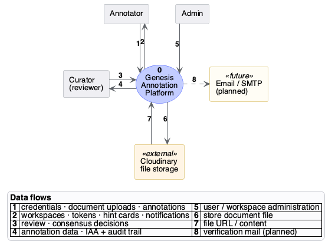

# Genesis Handbook

Genesis is a collaborative platform for linguistic annotation. Teams create
workspaces, upload text corpora, and annotate them for **coreference
resolution**, **named-entity recognition (NER)**, **part-of-speech (POS)
tagging**, and **word-sense disambiguation (WSD)** — then export the results
in standard formats such as CoNLL-2012.

The simplest way to picture the system — users, the web app, the API, and
the data they exchange:

The platform is built as two applications plus a database:

| Component | Technology | Role |
|---|---|---|
| Backend | Spring Boot 3 (Java 21), modular monolith | REST API, auth, annotation logic, persistence |
| Frontend | Next.js 15 (TypeScript) | Web UI: workspaces, document management, annotation editors |
| Database | PostgreSQL 16 | All persistent state |

## How this handbook is organised

- **[User Guide](user-guide.md)** — how to use Genesis, screen by screen,
  written for annotators with no technical background.
- **[Repositories](repositories.md)** — the three Git repos, what each
  one owns, branching rules, and the license.
- **Backend** — [Architecture](backend/architecture.md) explains how the
  backend is built (modules, layers, events, auth); [Functionality](backend/functionality.md)
  explains what it does (features and flows).
- **Frontend** — [Architecture](frontend/architecture.md) covers the Next.js
  application structure; [Functionality](frontend/functionality.md) covers
  the user-facing behaviour.
- **Deployment** — [Setup](deployment/setup.md) takes a fresh machine to a
  running stack; [Operations](deployment/operations.md) covers day-2 tasks:
  logs, updates, backups, rollback.

## Deployment model in one paragraph

Both application repositories carry a long-lived `uni-prod` branch that
represents exactly what runs in production. A separate deployment repository
(`genesis-deploy`, where these docs live) fetches both repos at that branch,
builds each app with the Dockerfile maintained in its own repo, and starts
the full stack — PostgreSQL, backend, frontend — with a single
`docker compose` invocation wrapped in `./scripts/deploy.sh`. The same
scripts run in CI on every change, so a green pipeline means the deployment
works end-to-end.
