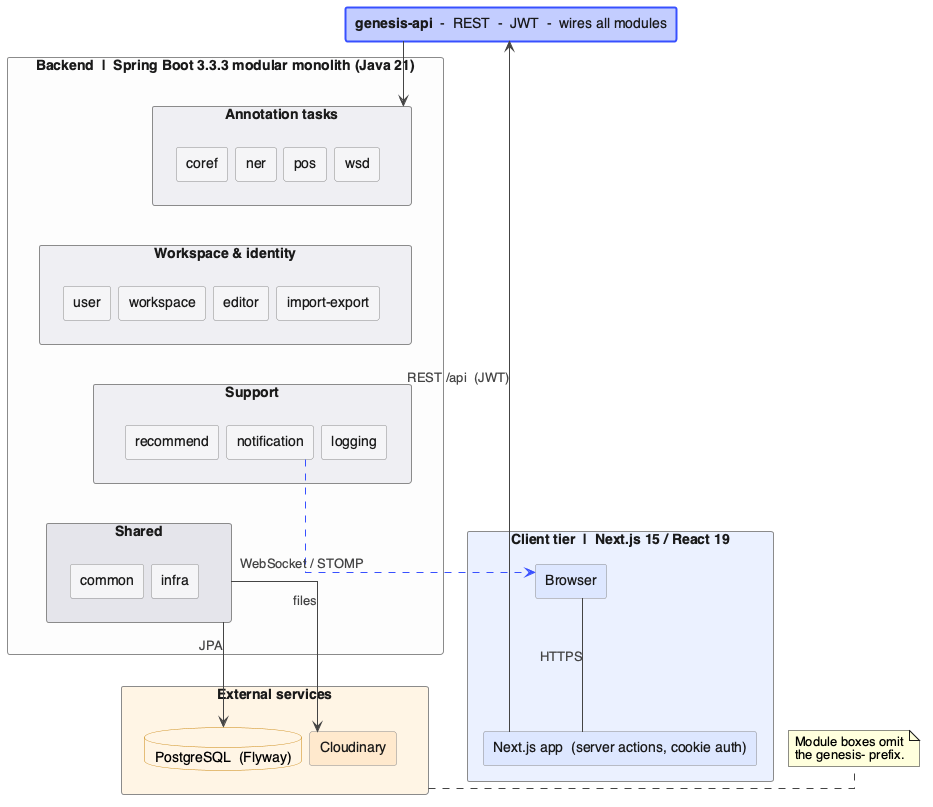
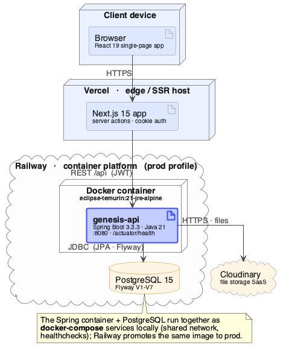

# The Three Repositories

Genesis is developed and deployed from three Git repositories, each with a
single, clear responsibility.



## 1. Backend — `genesis`

> <https://github.com/subarnasaikia/genesis>

The Spring Boot API server: authentication, workspaces, documents,
tokenization, all four annotation types, notifications, recommendations,
import/export, and PostgreSQL persistence. Ships its own `Dockerfile`.

| Branch | Meaning |
|---|---|
| `main` | Latest reviewed development state — every change lands here via PR |
| `uni-prod` | Exactly what runs in production; updated from `main` via PR |

## 2. Frontend — `genesis-frontend`

> <https://github.com/gautam84/genesis-frontend>

The Next.js web application: every screen described in the
[User Guide](user-guide.md). Talks only to the backend API. Ships its own
`Dockerfile`.

| Branch | Meaning |
|---|---|
| `main` | Latest reviewed development state — every change lands here via PR |
| `uni-prod` | Exactly what runs in production; updated from `main` via PR |

## 3. Deployment — `genesis-deploy`

> <https://github.com/subarnasaikia/genesis-deploy>

This repository. No application code — it defines **how Genesis runs**:

- `docker/docker-compose.yml` — the full stack (PostgreSQL + backend +
  frontend) as one unit;
- `scripts/` — fetch both app repos at `uni-prod`, build, start, verify;
- `config/.env.example` — every setting, documented;
- `docs/` — this handbook, published to GitHub Pages;
- `.github/workflows/` — CI that proves the whole pipeline works on every
  change.

| Branch | Meaning |
|---|---|
| `main` | The only branch — pipeline, config, and docs evolve here |

## How they work together

```
   genesis (backend)            genesis-frontend
        │  PR: main → uni-prod        │  PR: main → uni-prod
        ▼                             ▼
    [uni-prod]                   [uni-prod]
        └──────────┬──────────────────┘
                   │  fetched at deploy time by
                   ▼
            genesis-deploy  ──  ./scripts/deploy.sh  ──▶  running stack
```

The deployed system's shape on the host:



## Workflow rules

1. **Every change starts as a branch forked from fresh `main`** — in
   whichever app repo it belongs to. Never commit to `main` or `uni-prod`
   directly.
2. The branch is pushed and opened as **two pull requests**: one against
   `main`, one against `uni-prod` (when the change must reach production).
3. A maintainer reviews and merges both.
4. On the production host: `cd genesis-deploy && git pull &&
   ./scripts/deploy.sh` picks up the new `uni-prod` state.
5. Rollback = point `uni-prod` back at the previous commit and redeploy
   (see [Operations](deployment/operations.md)).

## License

All three repositories are licensed under **Apache License 2.0** — a
permissive license that lets anyone use, modify, and redistribute the code
(including commercially) with attribution, and includes an explicit patent
grant protecting users and contributors. Each repo carries the full text
in its `LICENSE` file.
